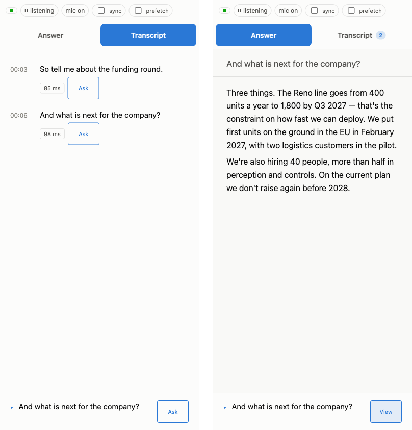
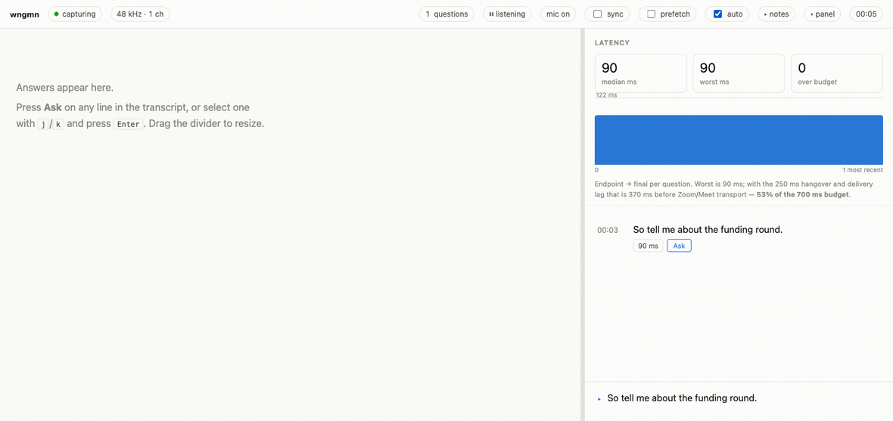

<h1>
  <picture>
    <source media="(prefers-color-scheme: dark)" srcset="docs/images/logo-dark.png">
    
  </picture>
  wngmn
</h1>

<sub>pronounced <b>wing-man</b></sub>

[](https://github.com/F-kItShipIt/wngmn/actions/workflows/ci.yml)


[](LICENSE)

A teleprompter for the half of the conversation you can't script.

**It heard the question. You take the credit.**

You take the call on Zoom or Meet. wngmn runs beside it, transcribes the question on your Mac, and pushes it to your phone. Tap Ask and Claude drafts a reply out of your profile. wngmn is not trying to join your meeting. It is already sitting next to you.


Every other tool in this space wants an account, a subscription, an Electron shell, and a virtual audio driver that outlives the uninstall. wngmn is 2.9 MB with no daemon, no driver and no account. It runs when you run it and it's gone when you quit. The only bill is your own Anthropic key.

## Install

```sh
git clone https://github.com/F-kItShipIt/wngmn.git && cd wngmn
Scripts/install.sh
```

Builds from source, drops wngmn.app in place, puts `wngmn` on your PATH. Sudo never comes up.

Or one line, same outcome. It's 142 lines of shell. You're about to pipe it into bash, so read it.

```sh
curl -fsSL https://raw.githubusercontent.com/F-kItShipIt/wngmn/main/Scripts/bootstrap.sh | bash
```

Three more and you're armed:

```sh
wngmn install-model --locale en-US    # Apple's 396 MB model. Mandatory.
wngmn selftest                        # tone = tap OK
export ANTHROPIC_API_KEY=sk-ant-...   # For Ask only. Shell profile it.
```

`selftest` failed? macOS denies this politely: every call returns success and hands back silence. Grant System Audio Recording, [docs/PERMISSIONS.md](docs/PERMISSIONS.md).

<details>
<summary>Pin a version, uninstall</summary>

```sh
git checkout v0.3.0 && Scripts/install.sh                 # inside a clone
curl -fsSL https://raw.githubusercontent.com/F-kItShipIt/wngmn/main/Scripts/bootstrap.sh | WNGMN_REF=v0.3.0 bash
Scripts/install.sh --uninstall
```

No download. The bundle is ad-hoc signed, so only the machine that built it gets the audio tap.

</details>

## Quick start

**1. Write a profile.** Format's further down. Call it `me.md`. Do this the night before.

**2. Start wngmn before the call, not during it.**

```sh
wngmn --listen --profile me.md
```

**3. Open the printed URL on your phone.** Bookmark it. The token survives restarts.

```
wngmn: live transcript → http://192.168.1.20:7373/?t=4fq8zj2m
wngmn:                    → http://your-mac.local:7373/?t=4fq8zj2m   (same page, stable name)
```

**4. Prop the phone just under your webcam.** Join the call. Your eyes stay honest.

Want it on the Mac? `wngmn --serve --profile me.md`, then http://127.0.0.1:7373.

It died and the call didn't:

```sh
wngmn --resume
```

No call to point it at? Feed it a recording from a clone:

```sh
wngmn offline Tests/WngmnAudioTests/Fixtures/two-questions.wav --serve --profile profiles/example-interview.md
```

## On your phone, during the interview



- **Transcript tab.** Each question, its latency, and its own Ask. The badge tallies the ones you haven't read yet.
- **Answer tab.** Where the reply streams in. Tap Ask and you're already here.
- **Live caption**, along the bottom. The question taking shape while they're still talking. Its Ask goes to the newest question and flips to **View** once that question has an answer.
- **prefetch.** Answers every caller question the second it lands, one API call apiece. Off by default; you pay for the ones you'd never have asked.
- **sync.** Laptop and phone stay on the same row. Off by default too.

## Examples you'll actually type

Both halves of the call, labelled Caller and You. Headphones on, or your mic hears them too.

```sh
wngmn --serve --mic --profile me.md
```

Pick the input and stop guessing the threshold. `--mic-device` switches `--mic` on for you.

```sh
wngmn miccheck
wngmn --serve --mic-device "BuiltInMicrophoneDevice" --mic-open-db -31 --profile me.md
```

Something other than Zoom or Chrome. Run `devices` mid-call; the audio never comes from the process you'd bet on.

```sh
wngmn devices                                          # mid-call
wngmn --serve --bundle-id <id you saw> --profile me.md
```

Everything the Mac plays. Yes, your music too.

```sh
wngmn --global --serve --profile me.md
```

One URL, bookmarked forever. Switches on `--listen`; `--new-token` burns it and issues another.

```sh
wngmn --token my-long-fixed-token --profile me.md
```

For the rambler, or the room with a fan in it. Stock: hangover 250 ms, open -45 dBFS, merge 700 ms.

```sh
wngmn --serve --hangover-ms 400 --open-db -38 --merge-ms 900 --profile me.md
```

Nothing touches the disk. Nothing to delete afterwards.

```sh
wngmn --serve --no-log --profile me.md
```

Think harder, or think elsewhere. Ships as `claude-opus-5` at `low`.

```sh
wngmn --serve --ask-model claude-opus-5 --ask-effort medium --profile me.md
```

All of it, at once, for the interview that matters.

```sh
wngmn --global --serve --listen --mic --mic-device "BuiltInMicrophoneDevice" --mic-open-db -31 --ask-effort medium
```

## Your profile

Three `##` headings get read. Any other `##` is named at startup and then ignored, so it fails loudly instead of quietly.

- `## Style`: the voice your answers arrive in.
- `## Context`: the raw material for answers. Pile it on; it's cached after the first Ask.
- `## Terms`: words the recogniser gets wrong, one per line: `Canonical | what it hears | another`.

```markdown
# Me, for interviews

## Style
Short sentences, concrete examples. Say "I don't know" when I don't.
Never use the word synergy.

## Context
I run infrastructure for a 12-person payments startup. Before that,
four years at a large company building experimentation tooling.

When asked about a failure, tell the one about the migration that
rolled back twice and what I changed afterward.

Don't mention that I've never actually read the Kubernetes docs.

## Terms
Kubernetes | cooper netties | goober netties
```

`--profile name` looks up `./profiles/name.md`; any path works. Edit it mid-call, it's re-read on every save. Vague profile, vague answers. Start from [profiles/TEMPLATE.md](profiles/TEMPLATE.md) or steal [profiles/example-interview.md](profiles/example-interview.md).

## Three profiles, three answers

Same binary, same question format. Only `## Context` changed.

**Hiring** · `--profile hiring` · *"Tell me about a time you disagreed with your manager."*


**Investor** · `--profile investor` · *"What does your burn rate look like now?"*


**Technical** · `--profile technical` · *"How does the ledger handle a retry?"*


All three ship in [`profiles/`](profiles). Copy one, swap the contents, keep the headings.

## Nobody presses Ask

Tick **auto** and the button stops being the point. The same endpointing that draws the transcript decides when the other person has finished a turn, and the answer is drafted while they are still waiting for yours.



Your own turns go too, not just theirs — a recogniser clips the opening of a question (`Can you write…` becomes `To, a program to…`) far more often than it loses the whole thing, so the model is given the conversation and left to decide, rather than a rule here guessing from the shape of one line.

What it will not do is spend a call on your "mm-hm". Turns of your own under four words are dropped before they are sent, and the caller is never held to that floor. Four is measured, not picked: across four recorded sessions the real questions ran 7 to 12 words even when badly mangled, and the only turns below that were `Testing.` and `Hello, hello.`. Tune it with `--auto-own-min-words`, or set `0` to answer every one of them.

That is a call per turn, and the header counts them: `auto: 1 answered · 1 call`. A turn that needs no answer gets none — the model replies `NONE` and the page shows nothing — but the call was still made and still counted, which is why the number is on screen rather than buried.

## Ask, and your own key

Checked in this order: `ANTHROPIC_API_KEY`, `ANTHROPIC_AUTH_TOKEN`, then `ant auth login`. Find none and it says so at startup, not mid-question: `wngmn: no Anthropic credentials, so Ask will fail on every question.`

- `--ask-effort low|medium|high|xhigh|max`. Starts at `low`. A brilliant answer that arrives after you've started talking is worth nothing.
- `--ask-model`, starting at `claude-opus-5`.
- Each Ask ships the question, as many as six before it, and your profile to api.anthropic.com.

## How it works

```
Zoom / Chrome ─tap─▶ endpointer ─▶ SpeechAnalyzer ─▶ page ─Ask─▶ api.anthropic.com
  (its audio)       (RMS, 250 ms)   (on-device)      (phone)     (text, on click)
```

The long version lives in [docs/ARCHITECTURE.md](docs/ARCHITECTURE.md).

## Output


JSON Lines on stdout, diagnostics on stderr. Pipe it into whatever you like.

```json
{"type":"question","text":"So tell me about the funding round.","t0":0.51,"t1":2.38,"ms":57}
```

`ms` is the latency for that question. `revises: true` overwrites the line before it: they paused mid-sentence and carried on. `volatile: true` means the wording isn't certain yet.

## Privacy

There is no server, so there is nothing to collect and no way for this project to reach you. No analytics, no crash reporter, no dependencies at all. Ask runs on your own API key, which means that traffic is between you and Anthropic and nobody is standing in the middle of it.

The whole binary contains two URLs. Don't take my word for it:

```sh
strings "$(which wngmn)" | grep -oE 'https?://[a-zA-Z0-9./-]+' | sort -u
# http://127.0.0.1
# https://api.anthropic.com/v1/messages
```

The complete list of things that leave your Mac:

- Audio: never. Not to transcribe, not to find the end of a question.
- Ask: the question, the recent ones, your profile. Off to api.anthropic.com when you click.
- **prefetch**, if you switch it on: every caller question goes the moment it lands, no click. Their words, not just yours.
- **auto**, if you switch it on: every caller turn goes as it ends, no click, and each answer builds on the ones before it in a running conversation with Claude. Off by default; the loudest change to this list, so it is the one you turn on deliberately.
- `install-model`: a download from Apple.
- Transcript: your local disk, and only while `--serve` is up. `--no-log` turns it off.
- `--listen`: the page goes on your LAN, gated by the URL token.

## Is this cheating?

It's a prompter. Newsreaders use one. It knows only what you typed into a file, and it does none of the talking. Some rooms ban help, though, and some interviewers just ask. Know which room you're walking into.

## What wngmn is not

wngmn is not a meeting recorder designed for secretly collecting conversations. It is not intended to bypass consent requirements, workplace policies, interview rules, or local recording laws. Audio and transcription laws vary depending on where you live and who is participating in the conversation. Make sure your use complies with the rules that apply to you. It is also not trying to replace your brain. It is trying to make sure your brain has backup.

## Intentionally boring

wngmn is intentionally boring in a few places. There is no framework where a few hundred lines of Swift will do. There is no cloud service where macOS already provides the capability locally. There is no database where a file will work.

## Contributing

If you find a bug, open an issue. If you know why the audio pipeline behaves differently on a machine it has absolutely no reason to behave differently on, definitely open an issue. Pull requests are welcome. Keep changes focused, keep dependencies justified, and try not to turn the tiny HTTP server into Kubernetes.

`swift test` runs 417 tests; five suites want the speech model first. Start with [CONTRIBUTING.md](CONTRIBUTING.md), then work through [permissions](docs/PERMISSIONS.md), [the page](docs/PAGE.md), [tuning](docs/TUNING.md), [architecture](docs/ARCHITECTURE.md) and [the GIFs](docs/tapes/README.md). [CODE_OF_CONDUCT.md](CODE_OF_CONDUCT.md) is in force. Found a security hole? GitHub private vulnerability reporting, details in [SECURITY.md](SECURITY.md).

## The name

It's wingman with the vowels taken out. A good wingman stays out of the way, and so do the vowels.

## Licence

MIT. Take it, fork it, ship it. Just don't blame the wingman.
