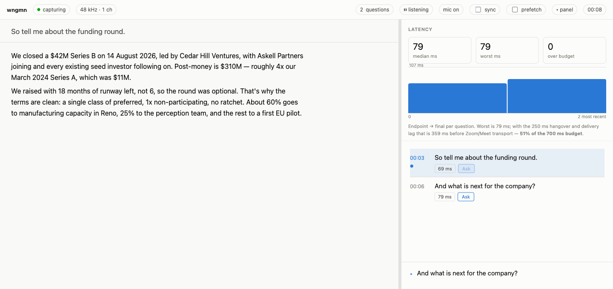

# wngmn

**Hears the question on a call, transcribes it on your Mac, and knows the moment it ended.**

Live captions tell you what was said. They don't tell you when a question is *over*, which is
the only thing that matters if something has to react to it. wngmn endpoints the question
itself instead of waiting on the Speech framework. Audio never leaves your machine.



<sub>Replaying a recorded fixture at real speed. The latency shown is measured, not illustrative.</sub>

## Requirements

- macOS 26, and a Swift 6.2 toolchain.
- No third-party dependencies. A clean machine builds with no network fetch.
- A speech model, installed once. One command, below.
- No credentials, except for the Ask button.

## Install

```sh
curl -fsSL https://raw.githubusercontent.com/skhan75/wngmn/main/Scripts/bootstrap.sh | bash
```

This builds from source on your machine, installs `wngmn.app`, and links `wngmn` onto your
PATH. It takes a few minutes on a cold checkout and needs no `sudo`.

Then the two steps that make it usable:

```sh
wngmn install-model --locale en-US   # 396 MB, from Apple
wngmn selftest                       # plays a tone, asserts the tap heard it
```

The model is a hard prerequisite, not a lazy download. Without it a run stops immediately
rather than transcribing silence for a whole call.

If `selftest` fails, macOS denied System Audio Recording. A denial is silent in the worst way:
every Core Audio call still returns success and the stream is digital silence, indistinguishable
from a quiet room. That is the entire reason this check exists —
[docs/PERMISSIONS.md](docs/PERMISSIONS.md).

<details>
<summary>Why there is no prebuilt binary to download</summary>

The bundle is ad-hoc signed, so it is trusted only by the machine that produced it. A binary
downloaded from a release would be quarantined by Gatekeeper, and its microphone entitlement
would not be honoured — which for this tool fails silently, as a call transcribed from digital
silence. Publishing real binaries needs a Developer ID certificate and notarisation. Until
that exists, compiling locally is the only way the permissions actually work.

</details>

<details>
<summary>Manual install, pinning a version, and uninstalling</summary>

```sh
git clone https://github.com/skhan75/wngmn.git && cd wngmn
Scripts/install.sh                      # build, bundle, sign, link
```

Or run the binary straight out of the build directory without installing at all:

```sh
swift build -c release
./.build/release/wngmn selftest
```

The installer takes `WNGMN_REF` to pin a branch, tag or commit, and `PREFIX` / `BINDIR` to
choose where things land:

```sh
BOOT=https://raw.githubusercontent.com/skhan75/wngmn/main/Scripts/bootstrap.sh

curl -fsSL $BOOT | WNGMN_REF=main BINDIR=~/bin bash   # pin a ref, choose the link directory
curl -fsSL $BOOT | bash -s -- --uninstall             # remove the app and the link
```

One caveat if you keep both: running `wngmn` bare resolves through `$PATH` to whatever was
installed last, which is a different binary from `./.build/release/wngmn` and holds a different
permission grant. When testing a local build, run it by path.

</details>

## Try it without a call

Replays a recorded fixture through the real pipeline and serves the page. Needs no audio
permission, and the shipped example profile means **Ask** works too. The fixture and the
profile live in the repository, so this one needs a checkout:

```sh
git clone https://github.com/skhan75/wngmn.git && cd wngmn

wngmn offline Tests/WngmnAudioTests/Fixtures/two-questions.wav \
  --serve --profile profiles/example-interview.md
```

Open http://127.0.0.1:7373, wait for the two questions to land, press **Ask** on either.

## Examples

**The everyday one.** Taps Zoom and Chrome, serves on loopback.

```sh
wngmn --serve
```

**Both sides of the call.** Each line is labelled Caller or You. Assumes headphones — on
speakers your mic hears the caller too and their words appear under both labels.

```sh
wngmn --serve --mic
```

**Tune the mic to your room.** Run `wngmn miccheck` first; it measures and prints the number to
use. `wngmn devices` lists the UIDs.

```sh
wngmn --serve --mic --mic-device "BuiltInMicrophoneDevice" --mic-open-db -31
```

**Tap something that isn't Zoom or Chrome.** The default scope is
`us.zoom.xos`, `us.zoom.CptHost`, `us.zoom.caphost`, `com.google.Chrome` and
`com.google.Chrome.helper`. For Teams, Slack huddles, FaceTime or a browser that isn't Chrome,
find the bundle ID and name it. Do this while the call is running: the list is of processes
currently producing audio, and conferencing apps rarely render call audio from the process you
would guess.

```sh
wngmn devices                                    # lists audio processes and their bundle IDs
wngmn --serve --bundle-id <the one you saw>      # repeatable, replaces the default list
wngmn --serve --global                           # or skip the guessing entirely
```

`--global` taps every sound on the machine, music and notifications included. It is the
reliable way to find out whether an app is tappable at all, and the fastest thing to reach for
when a scoped run transcribes nothing.

**Read it on your phone**, so the transcript is not on the screen you are sharing. Prints a URL
with a token in it.

```sh
wngmn --serve --listen
```

**Everything at once**, which is a realistic setup for a call on an app outside the default
scope:

```sh
wngmn --global --serve --listen --mic \
  --mic-device "BuiltInMicrophoneDevice" \
  --mic-open-db -31 --ask-effort medium
```

**A bookmarkable URL** that survives restarts, instead of a new token each run. Note this
implies `--listen`: a token only means something once the port is on the network.

```sh
wngmn --serve --token my-long-random-string
```

**A slow talker, or a noisy room.** Longer hangover waits out mid-sentence pauses; a lower
threshold picks up a quieter caller. Defaults are 250 ms and -45 dBFS.

```sh
wngmn --serve --hangover-ms 400 --open-db -50
```

**Nothing on disk.** By default a session log is written only while the server runs.

```sh
wngmn --serve --no-log
```

**Come back after a crash**, with the transcript intact.

```sh
wngmn --serve --resume
```

**Better answers, at the cost of latency.** Effort defaults to `low` because on a live call
latency is the binding constraint.

```sh
wngmn --serve --profile my-interview --ask-model claude-opus-5 --ask-effort high
```

`wngmn --help` prints every flag.

## Profiles

A profile is one markdown file holding the material answers are built from. Without one, Ask
has nothing but the question itself.

Three headings, all optional, and only these three are read:

| Section | |
| --- | --- |
| `## Style` | how answers should be shaped. Passed to the model verbatim. |
| `## Context` | the substance to answer from. Be generous; it is cached after the first ask. |
| `## Terms` | jargon the recogniser mishears, as `Canonical \| what it hears \| another` |

Ordinary markdown works inside a section, `###` headings included. Only a `##` line starts a new
section, and an unrecognised `##` heading is reported on startup rather than silently ignored.

```sh
wngmn --serve --profile interview          # resolves to ./profiles/interview.md
wngmn --serve --profile ~/notes/board.md   # or give a path
```

Start from [profiles/TEMPLATE.md](profiles/TEMPLATE.md), or copy
[profiles/example-interview.md](profiles/example-interview.md) and replace its contents. The
file is re-read when it changes on disk, so you can edit it mid-call.

`--profile` supersedes `--notes` rather than combining with it. Passing both currently reads
the profile only, without a warning.

## Answers: bring your own key


<sub>Real speed, real API call. The two questions endpoint at 69 ms and 79 ms; the answer is
built from the shipped example profile.</sub>

Capture, transcription and endpointing are entirely local and need no account. **Ask is the
only feature that talks to a network**, and it is off until you press the button.

Set a key and it works. wngmn checks three sources, in this order, and stops at the first:

| | |
| --- | --- |
| `ANTHROPIC_API_KEY` | a standard API key. Sent as `x-api-key`. |
| `ANTHROPIC_AUTH_TOKEN` | an OAuth access token. Sent as a bearer token. |
| `ant auth login` | the profile written by the Claude CLI, read by shelling out to it. This is how a Claude subscription is reached rather than pay-as-you-go billing. |

```sh
# Get a key from https://console.anthropic.com/settings/keys
echo 'export ANTHROPIC_API_KEY=sk-ant-...' >> ~/.zshrc
exec zsh
```

An exported-but-empty variable counts as absent, not as a bad key, because a half-written
shell profile is the usual cause and a 401 is a much worse error message than "no credentials".

You do not have to wait until the call to find out. With `--serve`, a run with no usable
credential says so at startup:

```
wngmn: no Anthropic credentials, so Ask will fail on every question.
wngmn: set ANTHROPIC_API_KEY, or run `ant auth login`, before the call.
```

### Choosing the model

```sh
wngmn --serve --ask-model claude-opus-5 --ask-effort low
```

Effort takes `low`, `medium`, `high`, `xhigh` or `max`, and defaults to **low** on purpose: on
a live call the answer is useless if it arrives after you needed it, so latency is the binding
constraint rather than depth. Raise it when rehearsing, not mid-interview.

### What a single Ask sends

The question, up to six preceding questions, and your profile go to
`https://api.anthropic.com/v1/messages`. The answer streams back token by token, so the page
fills in as it is generated rather than after it finishes.

Your profile is identical on every ask in a session and the question is not, so the profile is
sent behind a cache breakpoint. The first ask pays for it; later ones read it from cache. This
is why a long `## Context` costs far less than its size suggests, and why being generous with
it is the right instinct.

### Cost, and the one switch that changes it

One Ask is one API call. The **prefetch** toggle in the page header changes the economics
completely: it answers every caller question the moment it lands, including every question you
would never have pressed the button for. It exists because it moves the round trip behind your
decision to press rather than in front of it, making Ask feel instant. It is off by default
because most questions in a call do not need an answer, and you pay for all of them.

Questions from your own microphone are never prefetched, so `--mic` does not double the bill.

## The page

Embedded in the binary, fetches nothing, works offline. It is what you look at for the whole call.

- Questions as they finish, each with its latency and an **Ask** button.
- A live caption line for the sentence in progress.
- Latency charted against the 700 ms budget.
- Warnings, such as the tap going quiet mid-call.
- `j` / `k` to select a line, `Enter` to ask.

[docs/PAGE.md](docs/PAGE.md) covers it control by control.

## Flags worth knowing

| Flag | |
| --- | --- |
| `--serve`, `--port <n>`, `--listen` | serve the transcript; bind the network for a second device |
| `--mic`, `--mic-device <uid>` | also capture your microphone as a second speaker |
| `--profile <name>` | prepared material answers draw on |
| `--bundle-id <id>`, `--global` | which app to tap (default: Zoom and Chrome) |
| `--hangover-ms <n>` | silence before a question counts as over (default 250) |
| `--ask-model <id>`, `--ask-effort <level>` | which model answers, and how hard it thinks |
| `--no-log`, `--resume`, `--log-dir <path>` | the on-disk transcript |

`--port`, `--listen`, `--token`, `--new-token`, `--start-paused`, `--resume` and `--log-dir` all
imply `--serve`; `--mic-device` implies `--mic`. `--profile` supersedes `--notes`.

## Commands

| Command | |
| --- | --- |
| `run` (default) | capture, transcribe, endpoint, emit questions |
| `offline <file>` | run a recording through the same pipeline; needs no permission |
| `selftest` | play a tone and assert the tap hears it |
| `devices` | list audio processes, bundle IDs, and every device |
| `miccheck` | measure this room and this voice, print the `--mic-open-db` to use |
| `install-model` | download the speech model for `--locale` |
| `stop` | stop every running wngmn and release its audio devices |

## Output

JSON Lines on stdout, one object per line. Diagnostics go to stderr, so a pipe stays clean.


<sub>`wngmn offline … --speed 1 | jq -c .` — partials stream as the recogniser works, then one
`question` event lands with its measured endpoint-to-final latency.</sub>

```json
{"type":"question","text":"So tell me about the funding round.","t0":10.88,"t1":13.02,"ms":74}
{"type":"question","text":"So tell me a bit about the funding round you just closed.","t0":10.88,"t1":16.21,"ms":66,"revises":true}
{"type":"warning","code":"no_audio","detail":"no buffers for 92s"}
```

- `ms` — measured endpoint-to-final latency for that question.
- `revises` — supersedes the previous line rather than following it. The speaker paused
  mid-sentence and carried on.
- `volatile` — the wording came from the volatile stream and is less trustworthy.

## What leaves the machine

- **Audio never does.** Buffers are processed in memory and discarded. Nothing is recorded.
- **Ask sends text** to the Claude API: the question, up to six preceding ones, and your
  profile. By default this happens only when you press the button.
- **The prefetch toggle removes that guarantee.** It answers every caller question as it lands,
  including ones you'd never have asked. Off by default; it costs an API call per question.
- **`install-model` downloads from Apple.** Explicit, and only that command.
- **The transcript hits disk only with `--serve`**, under
  `~/Library/Application Support/wngmn/sessions/`, so a run that dies mid-call can resume.
  `--no-log` turns it off.
- **`--listen` puts the page on your local network**, gated by the token in the printed URL.

## Scope

wngmn is for the case where you supply the substance in advance and the tool retrieves it at the
right moment: press and podcast interviews, panels, rehearsal against a recording.

The mechanism has no idea what kind of conversation it is in. Nothing in the code distinguishes
an interview from an exam or a technical screen, and nothing in it could. Where the tool is
appropriate is your judgement, under whatever rules apply to the conversation you are in.

The author's own position, so the above is not mistaken for indifference: it is not for
assessments.

## Docs

| | |
| --- | --- |
| [PERMISSIONS](docs/PERMISSIONS.md) | why a denial is silent, and how to get the grant |
| [PAGE](docs/PAGE.md) | the page, control by control |
| [TUNING](docs/TUNING.md) | endpointer values, which are worth moving, what to measure |
| [ARCHITECTURE](docs/ARCHITECTURE.md) | the tap, the ring buffer, forced finalisation, the event contract |

## Contributing

```sh
swift test          # 407 tests; needs no audio permission, but four suites need the model
```

`WngmnCore` is deliberately free of Core Audio and Speech, which is what lets its tests run in
any terminal. The tier that cannot be automated is a live rehearsal on a real call.

[CONTRIBUTING.md](CONTRIBUTING.md) has the rest.
[CODE_OF_CONDUCT.md](CODE_OF_CONDUCT.md) applies to everyone taking part.

## Security

`--listen` exposes a transcript of someone else's words on your local network, gated only by the
token. If you find a way past it, use GitHub's private vulnerability reporting rather than a
public issue. [SECURITY.md](SECURITY.md) has the details.

## Licence

MIT. See [LICENSE](LICENSE).
