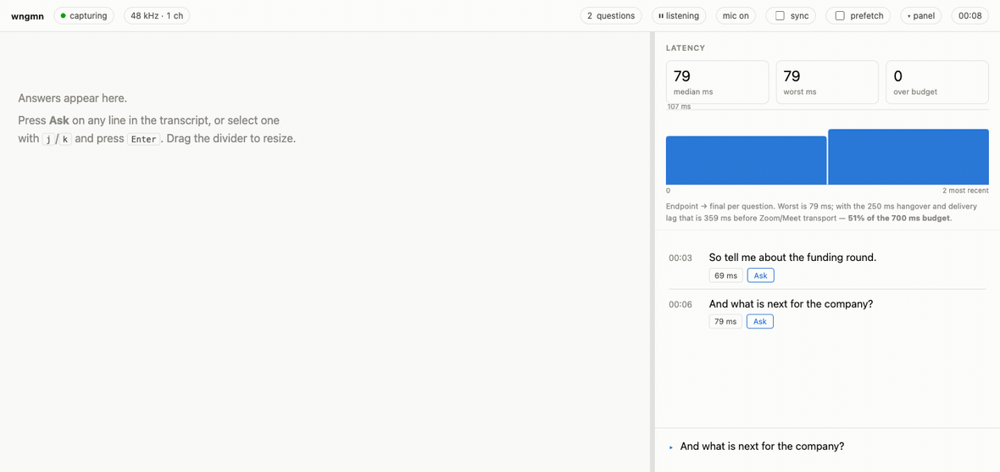

# wngmn

[](https://github.com/skhan75/wngmn/actions/workflows/ci.yml)


[](LICENSE)

wngmn is a teleprompter that listens.

It sits next to Zoom or Meet on your Mac and pays attention so you don't have to look like you're trying. It hears the question, writes it out on your phone, and when you tap Ask it hands you an answer in your own voice, built from whatever context you chose to give it. You glance down, you look up, and you sound like the version of yourself who slept eight hours and rehearsed.

wngmn is not trying to join your meeting. It is already sitting next to you. Hiring loops, press calls, podcasts, panels, and the quarterly review you forgot about all look the same to it.



## How it works

```
  Zoom / Meet                your Mac                          the page
  ───────────     ──────────────────────────────     ───────────────────────────
    audio   ───▶   tap the app's own output
                            │
                   find the end of the question
                            │
                   transcribe on the device     ───▶   the question appears
                            │                          (your phone via --listen,
                        tap Ask                         or the Mac over loopback)
                            │
                            ▼
                         Claude                 ───▶   the answer streams in
```

A Core Audio process tap, scoped to the meeting app, hears what Zoom or Chrome is playing and nothing else on your Mac. Not your microphone, not your music, not the other window. An endpointer watches the raw signal and decides for itself when the speaker has stopped rather than leaving it to the Speech framework, then forces the recogniser to finalise right there. That's where the speed comes from: about 75 ms from the end of a question to a structured event, against roughly 900 ms if you wait politely. A short pause mid-question counts as a hesitation, and the rest gets stitched back on.

Transcription is on-device, with Apple's SpeechAnalyzer. A hand-rolled HTTP and SSE server pushes each question to a page embedded in the binary that fetches nothing. Nothing shows up on the screen you're sharing. Tap Ask and the question, a few before it, and your profile go to Claude, which streams the answer back as it's written.

## What you get

- It listens to the call, not the whole computer. Zoom and Meet in Chrome work out of the box; `--bundle-id` covers another app, `--global` taps everything.
- It finds the end of a question from the audio itself, so questions land in tens of milliseconds, not most of a second.
- It transcribes on the device, so turning speech into text never touches the network.
- It prints one JSON line per question, so you can pipe questions into anything else you like.
- It serves the transcript to your phone over SSE, so the prompt stays in your hand and off your screen share.
- It writes the transcript to disk while the page is served, so if the process dies `wngmn --resume` picks up the same session.
- `--mic` adds your microphone as a second speaker, so the transcript reads Caller and You instead of a monologue. Wear headphones.
- It streams answers from Claude, shaped by a profile that holds exactly what you want it to know and nothing more.

## Privacy

Audio never leaves your Mac, not to transcribe, not to find the end of a question, not for anything. It's handled in memory and never recorded. Everything that does leave:

- **Ask**: the question, up to six before it, and your profile, as text, to api.anthropic.com, only when you click.
- **install-model**: fetches the speech model from Apple, once.
- **Transcript**: to local disk, only while the page is served. `--no-log` turns it off.
- **--listen**: the page, on your LAN, behind the token in the URL.

Until you press Ask, wngmn is a very attentive local process with nothing to say to anyone.

## Install

You need macOS 26 and a Swift 6.2 toolchain. Nothing else: no package managers to appease, no runtime to install.

```sh
curl -fsSL https://raw.githubusercontent.com/skhan75/wngmn/main/Scripts/bootstrap.sh | bash
```

That builds from source, installs wngmn.app, and links `wngmn` onto your PATH. A few minutes, no sudo. Prefer to see what you're running? `git clone https://github.com/skhan75/wngmn.git && cd wngmn && Scripts/install.sh` does the same thing. There's no prebuilt binary: the bundle is ad-hoc signed, so a downloaded copy would be quarantined and silently lose its microphone entitlement.

Then the speech model. Not optional: without it a run stops immediately rather than transcribing silence.

```sh
wngmn install-model --locale en-US   # 396 MB, from Apple
wngmn selftest                       # plays a tone, checks the tap heard it
```

Don't skip the selftest. If macOS denied System Audio Recording, Core Audio reports success and delivers silence; this is the only thing that will tell you. See [docs/PERMISSIONS.md](docs/PERMISSIONS.md).

Ask needs an Anthropic credential; nothing else does. Put `export ANTHROPIC_API_KEY=sk-ant-...` in your shell profile (an `ANTHROPIC_AUTH_TOKEN` or `ant auth login` works too). Without one, wngmn warns at startup and everything except Ask still runs.

## Quick start

Write a profile (example below), then start wngmn before the call.

```sh
wngmn --listen --profile me.md
```

It prints a URL with a token in it. Open it on your phone, and put the phone just below the camera so your eyes stay honest. Join the call as usual. Questions appear as they're asked; tap Ask when you want a hand. The answer streams in while you're still nodding.

Want the page on the Mac instead? `--serve` alone binds http://127.0.0.1:7373. Did wngmn die mid-call? `wngmn --resume` continues the most recent session from disk. No call handy? From a clone of the repo:

```sh
wngmn offline Tests/WngmnAudioTests/Fixtures/two-questions.wav --serve --profile profiles/example-interview.md
```

## Your profile

The profile is a plain markdown file, and it's the only thing Claude ever knows about you. Put in whatever you'd want a sharp friend to know before speaking on your behalf. Three headings are read; any other `##` is reported at startup and ignored.

```markdown
# Me, for interviews

## Style
Short sentences, concrete examples. Say "I don't know" when I don't.
Never use the word synergy.

## Context
I run infrastructure for a 12-person payments startup. Before that,
four years at a large company building experimentation tooling.

When asked about a failure, tell the one about the migration that
rolled back twice and what I changed afterward.

Don't mention that I've never actually read the Kubernetes docs.

## Terms
Kubernetes | cooper netties | goober netties
```

Style goes to the model verbatim. Context is cached after the first ask, so be generous. Terms catches jargon the recogniser mishears. The file is re-read when it changes, so you can fix it mid-call. Vague profiles produce vague answers. Start from [profiles/TEMPLATE.md](profiles/TEMPLATE.md), or steal [profiles/example-interview.md](profiles/example-interview.md).

## Output


Every question goes to stdout as one line of JSON. Diagnostics go to stderr, so pipes stay clean.

```json
{"type":"question","text":"So tell me about the funding round.","t0":0.51,"t1":2.38,"ms":57}
```

`ms` is the measured endpoint-to-final latency. `revises: true` marks a question that supersedes the previous one: they paused mid-sentence and wngmn stitched the rest back on. `volatile: true` marks wording from the volatile stream. There are `partial`, `status` and `warning` lines too.

## Is this cheating?

It's a prompter. Newsreaders, presidents, and every keynote speaker you've ever admired have used one, and nobody accuses them of not knowing their lines. wngmn doesn't speak for you and doesn't know a single thing you didn't write down. It hands you a well-formed draft and you decide what to do with it.

Some interviews forbid outside help, and some interviewers will ask. Know the rules of the room you're walking into. The tool does the listening, and the choices are yours.

## What wngmn is not

wngmn is not a meeting recorder designed for secretly collecting conversations. It is not intended to bypass consent requirements, workplace policies, interview rules, or local recording laws. Audio and transcription laws vary depending on where you live and who is in the conversation. Make sure your use complies with the rules that apply to you.

It is also not trying to replace your brain. It is trying to make sure your brain has backup.

## Intentionally boring

wngmn is intentionally boring in a few places. There is no framework where a few hundred lines of Swift will do. There is no cloud service where macOS already provides the capability locally. There is no database where a file will work.

## Contributing

If you find a bug, open an issue. If you know why the audio pipeline behaves differently on a machine it has absolutely no reason to behave differently on, definitely open an issue.

Pull requests are welcome. Keep changes focused, keep dependencies justified, and try not to turn the tiny HTTP server into Kubernetes. `swift test` runs 407 tests; four suites need the speech model. Security issues go through GitHub's private vulnerability reporting, not a public issue.

Docs: [permissions](docs/PERMISSIONS.md) · [the page](docs/PAGE.md) · [tuning](docs/TUNING.md) · [architecture](docs/ARCHITECTURE.md) · [tapes](docs/tapes/README.md) · [CONTRIBUTING](CONTRIBUTING.md) · [SECURITY](SECURITY.md) · [CODE_OF_CONDUCT](CODE_OF_CONDUCT.md)

## The name

It's wingman with the vowels taken out. A good wingman stays out of the way, and so do the vowels.

## License

It's [MIT licensed](LICENSE). Take it, fork it, ship it. Just don't blame the wingman.
