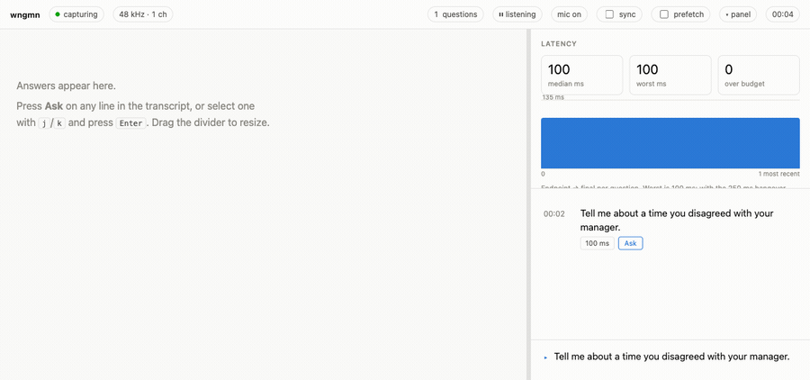
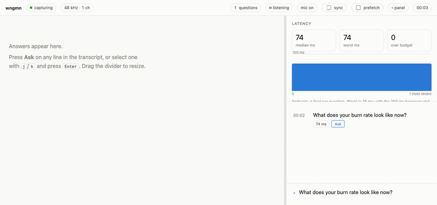
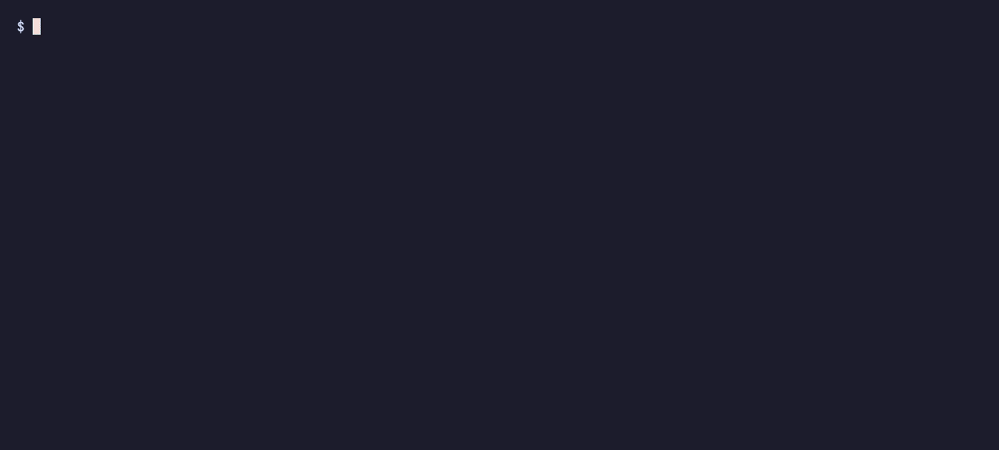

# Using wngmn: the flags worth knowing, with examples

[wngmn](../README.md) · [Architecture](ARCHITECTURE.md) · [Permissions](PERMISSIONS.md) · [Tuning](TUNING.md) · [The page](PAGE.md) · [Security](../SECURITY.md) · [Contributing](../CONTRIBUTING.md)

The [README](../README.md) gets you running. This is the rest: every flag worth knowing, what
each one costs, and what is going on underneath. Tuning the speech detector has its own page,
[TUNING.md](TUNING.md); permissions and audio routes have [PERMISSIONS.md](PERMISSIONS.md); the
page you read during a call has [PAGE.md](PAGE.md).

## Examples you'll actually type

Both halves of the call, labelled Caller and You, from whatever app the call is in. That is what it does with no flags at all. On speakers your mic hears them too, so it is ignored while they talk ([TUNING.md](TUNING.md#the-microphone-endpointer)); on headphones nothing of yours is lost.

```sh
wngmn --serve --profile me.md
```

Their side only.

```sh
wngmn --serve --no-mic --profile me.md
```

Pick the input and stop guessing the threshold.

```sh
wngmn miccheck
wngmn --serve --mic-device "BuiltInMicrophoneDevice" --mic-open-db -31 --profile me.md
```

It hears everything the Mac plays. Yes, your music too. Keep it to the call apps it knows, Zoom and Chrome.

```sh
wngmn --serve --call-apps --profile me.md
```

Or to one app you name. Run `devices` mid-call; the audio never comes from the process you'd bet on.

```sh
wngmn devices                                          # mid-call
wngmn --serve --bundle-id <id you saw> --profile me.md
```

A token you choose. Switches on `--listen`. Plain `--listen` already stores a generated token and reuses it every run, so its URL is stable too; `--new-token` replaces that stored one. A `--token` you pass changes when you pass a different one.

```sh
wngmn --token my-long-fixed-token --profile me.md
```

For the rambler, or the room with a fan in it. Stock: hangover 250 ms, open -45 dBFS, merge 700 ms.

```sh
wngmn --serve --hangover-ms 400 --open-db -38 --merge-ms 900 --profile me.md
```

Nothing touches the disk. Nothing to delete afterwards.

```sh
wngmn --serve --no-log --profile me.md
```

Think harder, or think elsewhere. Ships as `claude-opus-5` at `low`.

```sh
wngmn --serve --ask-model claude-opus-5 --ask-effort medium --profile me.md
```

They pasted the problem into a doc instead of saying it. Press a key: the wngmn that is already running takes a picture of your screen and answers it, nobody presses Ask, and the picture stays in the conversation — so when they then *say* "can you do that in place?", it knows what "that" is.

```sh
wngmn shot             # the whole screen, at once
wngmn shot --region    # drag a rectangle; Space for a window, Esc to cancel
```

wngmn has no hotkey of its own, on purpose: bind those two to keys. In the Shortcuts app, new shortcut → **Run Shell Script** → the full path to wngmn, then `shot --region` → the ⓘ panel → **Add Keyboard Shortcut**. Shortcuts does not read your shell's `PATH`, so ask your terminal where it is — `command -v wngmn` — rather than copying anyone else's: `/opt/homebrew/bin/wngmn` on an Apple Silicon Mac with Homebrew, `/usr/local/bin` or `~/.local/bin` elsewhere. Raycast, Alfred and skhd do the same in a line. Try both once before the call: the first shot is when macOS asks for Screen Recording.

All of it, at once, for the interview that matters.

```sh
wngmn --listen --mic-device "BuiltInMicrophoneDevice" --mic-open-db -31 --ask-effort medium
```

## Auto, and your own turns

Auto is on unless you start with `--no-auto`, or there is no API key to answer with. The same endpointing that draws the transcript decides when the other person has finished a turn, and the answer is drafted while they are still waiting for yours. Every turn goes into one running conversation, so each answer builds on the ones before it.

Your own turns go too, not just theirs — a recogniser clips the opening of a question (`Can you write…` becomes `To, a program to…`) far more often than it loses the whole thing, so the model is given the conversation and left to decide, rather than a rule here guessing from the shape of one line.

What it will not do is spend a call on your "mm-hm". Turns of your own under four words are dropped before they are sent, and the caller is never held to that floor. Four is measured, not picked: across four recorded sessions the real questions ran 7 to 12 words even when badly mangled, and the only turns below that were `Testing.` and `Hello, hello.`. Tune it with `--auto-own-min-words`, or set `0` to answer every one of them.

That is at most a call per turn — turns that close while an answer is on its way go out together as one — and the side panel counts them: `auto: 1 answered · 1 call`. A turn that needs no answer gets none — the model replies `NONE` and the page shows nothing — but the call was still made and still counted, which is why the number is on screen rather than buried.

## Ask, and your own key

Checked in this order: `ANTHROPIC_API_KEY`, `ANTHROPIC_AUTH_TOKEN`, then `ant auth login`. Find none and it says so at startup, not mid-question: `wngmn: no Anthropic credentials, so Ask will fail on every question.`

- `--ask-effort low|medium|high|xhigh|max`. Starts at `low`. A brilliant answer that arrives after you've started talking is worth nothing.
- `--ask-model`, starting at `claude-opus-5`.
- Each Ask ships the question, as many as six before it, and your profile to api.anthropic.com.
- A `wngmn shot` ships a picture — shrunk to 2576 px on its long edge, which is all the model reads — and the conversation so far. Around 1,800 tokens for a dragged region, 4,800 for a whole 4K screen.

## Three profiles, three answers

Same binary, same question format. Only `## Context` changed.

**Hiring** · `--profile hiring` · *"Tell me about a time you disagreed with your manager."*



**Investor** · `--profile investor` · *"What does your burn rate look like now?"*



**Technical** · `--profile technical` · *"How does the ledger handle a retry?"*


All three ship in [`profiles/`](../profiles). Copy one, swap the contents, keep the headings.

## How it works

```
Zoom / Chrome ─tap─▶ endpointer ─▶ SpeechAnalyzer ─▶ page ─Ask─▶ api.anthropic.com
  (its audio)       (RMS, 250 ms)   (on-device)      (phone)     (text on a click; a picture on a key)
```

The long version lives in [docs/ARCHITECTURE.md](ARCHITECTURE.md).

## Output



JSON Lines on stdout, diagnostics on stderr. Pipe it into whatever you like.

```json
{"type":"question","text":"So tell me about the funding round.","t0":0.51,"t1":2.38,"ms":57}
```

`ms` is the latency for that question. `revises: true` overwrites the line before it: they paused mid-sentence and carried on. `volatile: true` means the wording isn't certain yet.

## Intentionally boring

wngmn is intentionally boring in a few places. There is no framework where a few hundred lines of Swift will do. There is no cloud service where macOS already provides the capability locally. There is no database where a file will work.

## Two URLs

The whole binary contains two. Don't take anyone's word for it:

```sh
strings "$(which wngmn)" | grep -oE 'https?://[a-zA-Z0-9./-]+' | sort -u
# http://127.0.0.1
# https://api.anthropic.com/v1/messages
```

## No call to point it at

Feed it a recording, from a clone. `--speed 1` plays it at the pace it was spoken; without it
the file is over in under two seconds, and the page goes with it.

```sh
wngmn offline Tests/WngmnAudioTests/Fixtures/two-questions.wav --serve --speed 1 --profile profiles/example-interview.md
```

This goes through neither the audio tap nor the microphone, so it proves the recogniser and the
page and nothing about whether a live run will hear your call. For that, see *Try it now* in the
README.
